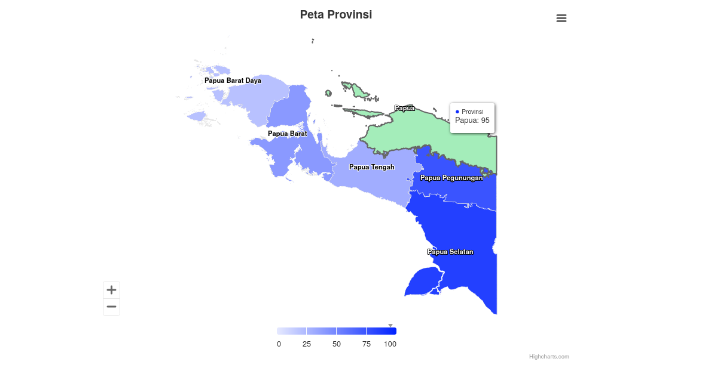

# Peta Pulau Papua

> Crafted by [Theis Andatu](https://antheiz.my.id)

Peta Pulau Papua dalam format GeoJSON. Data Peta Batas administrasi ini termasuk 4 provinsi pemekaran baru, Berikut ini daftar lengkap provinsi di Tanah Papua: 

## Provinsi

1. Papua 
2. Papua Barat
3. Papua Selatan
4. Papua Tengah 
5. Papua Pegunungan 
6. Papua Barat Daya

# Tech Stack

Anda dapat mengakses contoh penerapan data GeoJSON ini pada website demo yang bisa diakses [disini](https://antheiz.github.io/papua-maps-geojson)

## Lisensi

Copyright [MIT License](LICENSE) - 2023.
